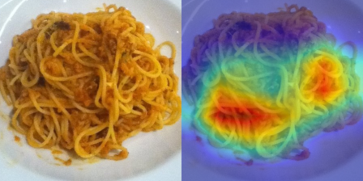
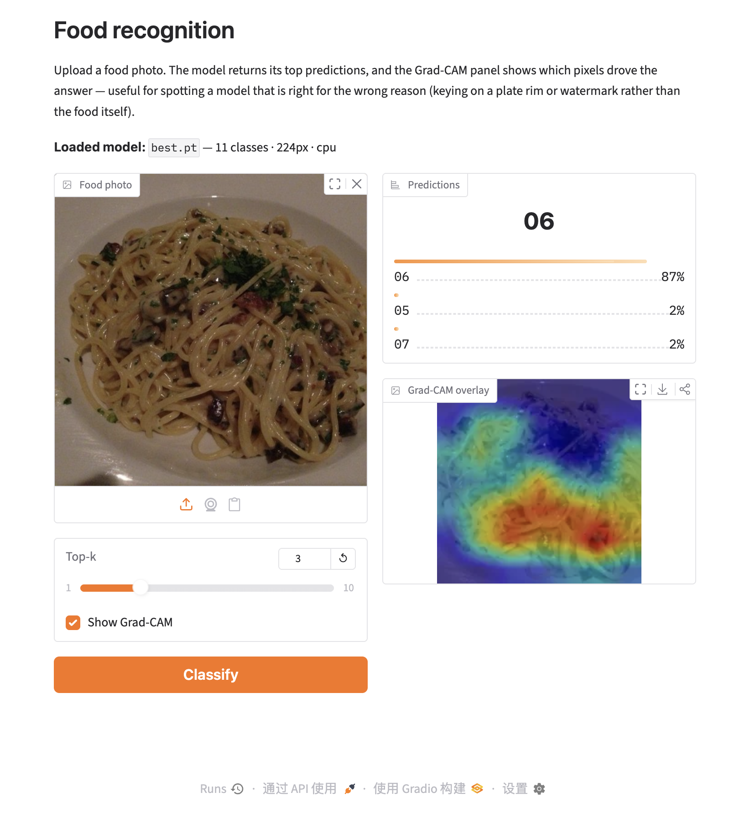
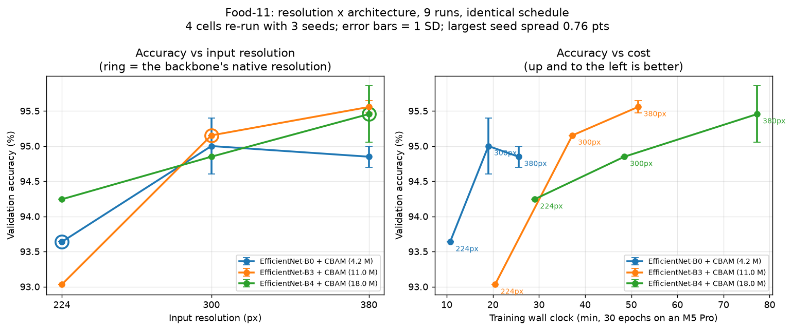
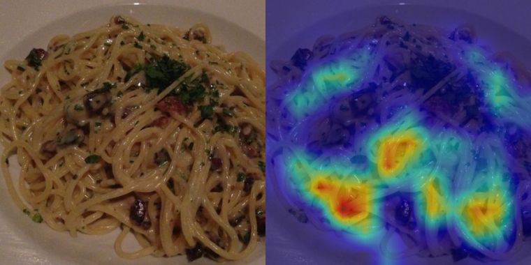
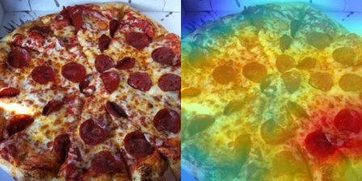

# Food Recognition

Food image classification with PyTorch: a configurable training pipeline with
CBAM attention, self-training on unlabelled data, and CLI tools for training,
evaluation and inference.

[](https://github.com/linhongyu510/food_recognition/actions/workflows/ci.yml)


[](LICENSE)

> **Status.** The pipeline, CLI and 423-test suite are verified and run in CI on
> every push. Food-11 and Food-101 accuracy are both measured and recorded with
> full provenance in [Benchmarks](#benchmarks).

---

## Contents

- [Install](#install)
- [Try it in 30 seconds](#try-it-in-30-seconds)
- [Data layout](#data-layout)
- [Training](#training)
- [Evaluation and inference](#evaluation-and-inference)
- [Explaining predictions (Grad-CAM)](#explaining-predictions-grad-cam)
- [Demo app](#demo-app)
- [Publishing weights to the Hugging Face Hub](#publishing-weights-to-the-hugging-face-hub)
  - [Published weights](#published-weights)
- [Python API](#python-api)
- [Models](#models)
- [Configuration](#configuration)
- [Self-training](#self-training)
- [Benchmarks](#benchmarks)
- [Statistical significance](docs/significance.md)
- [Attention gains vs seed noise](docs/attention_variance.md)
- [Project layout](#project-layout)
- [Development](#development)

---

## Install

Requires Python 3.9+ and PyTorch 2.4+.

```bash
git clone https://github.com/linhongyu510/food_recognition.git
cd food_recognition

python -m venv .venv && source .venv/bin/activate

# CPU-only torch (skips ~2GB of CUDA wheels). For GPU, follow pytorch.org.
pip install torch torchvision --index-url https://download.pytorch.org/whl/cpu

pip install -e .
```

Installing exposes three commands: `food-recognition-train`,
`food-recognition-eval` and `food-recognition-predict`.

## Try it in 30 seconds

No dataset download needed — this generates synthetic data and runs the full
train → evaluate → predict loop on CPU:

```bash
python scripts/make_sample_data.py --output data/sample
food-recognition-train --config configs/smoke_test.yaml
```

```
device=cpu
model=simple_cnn trainable_params=1,553,475
train samples=24
val samples=12
epoch   1/2 | loss 1.0129 | acc 0.6667 | val_loss 0.1638 | val_acc 1.0000 | ... | <- best
epoch   2/2 | loss 0.1960 | acc 0.9667 | val_loss 0.0116 | val_acc 1.0000 | pseudo 6 | ...

best val accuracy : 1.0000 (epoch 1)
best checkpoint   : runs/smoke/checkpoints/best.pt

class         precision     recall         f1  support
00               1.0000     1.0000     1.0000        4
01               1.0000     1.0000     1.0000        4
02               1.0000     1.0000     1.0000        4

accuracy                               1.0000       12
macro avg        1.0000     1.0000     1.0000       12
weighted avg     1.0000     1.0000     1.0000       12
```

This toy task is deliberately trivial (three solid colours); it verifies the
plumbing, not model quality.

## Data layout

Labelled splits use one sub-directory per class. The unlabelled pool is a
**flat** directory:

```
data/food-11/
├── training/
│   ├── labeled/          # class sub-directories
│   │   ├── 00/  01/  02/  ...  10/
│   └── unlabeled/        # flat: images directly inside, no class dirs
│       ├── 0001.jpg  0002.jpg  ...
└── validation/
    ├── 00/  01/  02/  ...  10/
```

Class directories named with digits are sorted **numerically**, so `10/` maps to
index 10 rather than sorting between `1/` and `2/`. Any directory names work —
`apple_pie/`, `bread/` — and the resolved names are stored in the checkpoint so
predictions come back as readable labels.

To download Food-11:

```bash
pip install -e ".[download]"
python scripts/download_dataset.py
```

### Food-101

Food-101 ships in its own layout — `images/<class>/<hash>.jpg` plus
`meta/train.txt` and `meta/test.txt` listing the official splits. Download it
from [the ETH Zurich page](https://data.vision.ee.ethz.ch/cvl/datasets_extra/food-101/)
(~4.7 GB), then convert it:

```bash
python scripts/prepare_food101.py --source /path/to/food-101 --output data/food-101
```

> The canonical archive is `http://data.vision.ee.ethz.ch/cvl/food-101.tar.gz`,
> but it served ~0.25 MB/s when this was measured — over 5 hours for one file.
> The [`ethz/food101`](https://huggingface.co/datasets/ethz/food101) mirror on
> Hugging Face carries the same 75,750 / 25,250 official split and downloaded in
> about two minutes. It ships Parquet rather than JPEG trees, so use the helper
> below to rebuild the official layout first:
>
> ```bash
> pip install -e ".[food101]"
> python scripts/food101_from_parquet.py --output ~/data/food-101
> python scripts/prepare_food101.py --source ~/data/food-101 --output data/food-101
> ```
>
> The official split survives the round trip because the mirror keeps each
> original filename in the Parquet `image.path` field, and class ordering is read
> from the shard's schema metadata rather than guessed. Verified against a direct
> rebuild: identical `meta/` files and byte-identical images.

This creates symlinks by default, so it finishes in seconds and adds almost no
disk usage. The links are relative, so moving the source and output together
keeps them valid. Use `--copy` for real files (needs another ~5 GB) when the
output has to stand on its own, or `--limit-per-class 50` for a fast smoke run.

The split assignment comes from the official meta files rather than a reshuffle,
so results stay comparable with published numbers.

```bash
food-recognition-train --config configs/food101_efficientnet_cbam.yaml
```

Food-101 is 101 classes and 75,750 training images, so it is far heavier than
Food-11: **8.5 min per epoch** on the Apple M5 Pro used for
[Benchmarks](#benchmarks), i.e. about 4.2 hours for the full 30-epoch schedule.

## Training

```bash
# Built-in configs
food-recognition-train --config configs/food11_resnet18.yaml
food-recognition-train --config configs/food11_efficientnet_cbam.yaml

# Override any field from the command line
food-recognition-train --config configs/food11_resnet18.yaml \
    --model-name resnet50_cbam --epochs 40 --batch-size 64 --lr 1e-4

# Or skip configs entirely
food-recognition-train \
    --model-name efficientnet_b0_cbam --num-classes 11 \
    --train-dir data/food-11/training/labeled \
    --val-dir data/food-11/validation \
    --epochs 30 --device cuda
```

Each run writes to `output_dir`:

```
runs/food11_resnet18/
├── checkpoints/
│   ├── best.pt        # best validation accuracy
│   └── last.pt        # most recent epoch
├── history.json       # per-epoch loss/acc/LR/duration
└── metrics.json       # best epoch: per-class P/R/F1 + confusion matrix
```

`--help` lists every flag. Relative paths in configs resolve against the
current working directory, so run commands from the repository root.

## Evaluation and inference

```bash
food-recognition-eval \
    --checkpoint runs/food11_resnet18/checkpoints/best.pt \
    --data-dir data/food-11/validation \
    --json-out report.json
```

```bash
# Single image
food-recognition-predict --checkpoint runs/.../best.pt --input photo.jpg

# Whole directory, top-5, saved as JSON
food-recognition-predict --checkpoint runs/.../best.pt \
    --input data/food-11/testing --topk 5 --json-out predictions.json
```

```
photo.jpg
  -> 07 (0.9412)  [07 0.941, 03 0.038, 01 0.011]
```

Checkpoints embed their architecture, image size and class names, so neither
command needs to be told the model again.

## Explaining predictions (Grad-CAM)

Grad-CAM shows *which pixels* drove a prediction, which is how you catch a model
that is right for the wrong reason — keying on a plate rim or a watermark rather
than the food.

```bash
# One image; writes gradcam/photo_gradcam.png
food-recognition-gradcam \
    --checkpoint runs/food11_resnet18/checkpoints/best.pt \
    --input photo.jpg

# Original next to the overlay, for a whole directory
food-recognition-gradcam \
    --checkpoint runs/food11_resnet18/checkpoints/best.pt \
    --input data/food-11/testing \
    --output-dir cams --side-by-side
```

```
photo.jpg
  -> 07 (0.9412)  saved cams/photo_gradcam.png
```

Real output from the benchmarked `efficientnet_b0_cbam` model on a validation
image of class `06` (noodles/pasta), predicted correctly at 0.9104 confidence —
original left, overlay right. The heat sits on the pasta itself rather than the
plate rim or background, which is what you want to confirm before trusting a
model's accuracy number:



Pass `--class-index` to ask *"why not that other class?"* — it explains the class
you name instead of the predicted one, which is the useful view when a model is
confidently wrong.

```python
from food_recognition import GradCAM, load_predictor, overlay_heatmap

predictor = load_predictor("runs/food11_resnet18/checkpoints/best.pt")
cam = GradCAM(predictor.model, classes=predictor.classes)

result, display = cam.generate_from_path("photo.jpg", image_size=224)
print(result.class_name, result.confidence)   # 07 0.9412
print(result.heatmap.shape)                   # (224, 224), values in [0, 1]

overlay_heatmap(display, result.heatmap, alpha=0.5).save("cam.png")
```

The target convolution layer is resolved automatically per architecture
(`layer4` for ResNet, `features` for EfficientNet/VGG, the CBAM block for CBAM
models). Override it with `GradCAM(model, target_layer=...)`. Hooks are removed
in a `finally` block, so a failed call cannot leave them attached, and the
model's train/eval mode is restored afterwards.

Implementation notes: this uses `register_full_backward_hook` (PyTorch's
docstring marks `register_backward_hook` as deprecated, warning that "the
behavior of this function will change in future versions") and resizes with
`torch.nn.functional.interpolate`, so **OpenCV is not a dependency**. The
colormap is computed in NumPy, so matplotlib is not required either.

## Demo app

A Gradio UI wrapping the same `Predictor` and `GradCAM` the CLI uses — upload a
photo, get top-k predictions and the heatmap side by side:

```bash
pip install -e ".[app]"
python app.py --checkpoint runs/food11_effnet_cbam/checkpoints/best.pt
```

Or run it straight from a checkpoint published on the Hub, with no local
training and no dataset download:

```bash
python app.py --hf-repo hylin16/food-recognition-food11-effnet-b3-cbam-380
```

That downloads the 45 MB checkpoint anonymously on first run and caches it. See
[Published weights](#published-weights) for the other five.



It runs on CPU without a GPU. Measured single-image latency on 2 threads, which
is what a free Hugging Face *CPU Basic* Space gets:

| Model | Input | Latency |
| --- | ---: | ---: |
| `efficientnet_b0_cbam` (11 classes) | 224px | 64 ms |
| `efficientnet_b4_cbam` (101 classes) | 224px | 180 ms |
| `efficientnet_b4_cbam` (11 classes) | 380px | 221 ms |

Grad-CAM roughly doubles that, since the heatmap needs a backward pass. The app
loads one checkpoint at startup and reads its architecture, resolution and class
names from the file, so the same command works for any run.

Deploying it as a Hugging Face Space is the same file plus a `README.md` header;
note that Gradio Spaces now
[require a paid plan](https://huggingface.co/docs/hub/spaces-overview), with an
exception for up to two ZeroGPU Spaces on a free personal account. Set
`FR_HF_REPO` (or `FR_CHECKPOINT`) as a Space variable instead of passing flags.

## Publishing weights to the Hugging Face Hub

`scripts/publish_to_hf.py` uploads a run's checkpoint with a model card
generated from that run's own `metrics.json` and embedded config, so the
published numbers cannot drift from what was measured:

```bash
pip install -e ".[app]"
huggingface-cli login

python scripts/publish_to_hf.py \
    --run runs/food11_effnet_cbam \
    --repo-id <user>/food-recognition-food11-effnet-b0-cbam \
    --commit "$(git rev-parse --short HEAD)" \
    --dry-run          # render the card without uploading
```

The card carries the accuracy, macro F1, checkpoint epoch, wall clock, hardest
and easiest class, the full training configuration, and a limitations section.
Checkpoints here run 16–73 MB, well inside the Hub's limits.

### Published weights

Every cell of the [resolution × architecture grid](#resolution-architecture) is
published, plus both Food-101 models — so every number in the benchmark tables
has a downloadable checkpoint behind it.

Food-11, ordered by accuracy:

| Model | Input | Accuracy | Size | Repo |
|---|---:|---:|---:|---|
| `b3_cbam` | 380px | **95.45%** | 45 MB | [`food11-effnet-b3-cbam-380`](https://huggingface.co/hylin16/food-recognition-food11-effnet-b3-cbam-380) |
| `b0_cbam` | 300px | **95.15%** | 17 MB | [`food11-effnet-b0-cbam-300`](https://huggingface.co/hylin16/food-recognition-food11-effnet-b0-cbam-300) |
| `b3_cbam` | 300px | 95.15% | 45 MB | [`food11-effnet-b3-cbam-300`](https://huggingface.co/hylin16/food-recognition-food11-effnet-b3-cbam-300) |
| `b4_cbam` | 380px | 95.00% | 73 MB | [`food11-effnet-b4-cbam-380`](https://huggingface.co/hylin16/food-recognition-food11-effnet-b4-cbam-380) |
| `b0_cbam` | 380px | 94.85% | 17 MB | [`food11-effnet-b0-cbam-380`](https://huggingface.co/hylin16/food-recognition-food11-effnet-b0-cbam-380) |
| `b4_cbam` | 300px | 94.85% | 73 MB | [`food11-effnet-b4-cbam-300`](https://huggingface.co/hylin16/food-recognition-food11-effnet-b4-cbam-300) |
| `b4_cbam` | 224px | 94.24% | 73 MB | [`food11-effnet-b4-cbam-224`](https://huggingface.co/hylin16/food-recognition-food11-effnet-b4-cbam-224) |
| `b0_cbam` | 224px | 93.64% | 17 MB | [`food11-effnet-b0-cbam`](https://huggingface.co/hylin16/food-recognition-food11-effnet-b0-cbam) |
| `b3_cbam` | 224px | 93.03% | 45 MB | [`food11-effnet-b3-cbam-224`](https://huggingface.co/hylin16/food-recognition-food11-effnet-b3-cbam-224) |

Food-101:

| Model | Input | Accuracy | Size | Repo |
|---|---:|---:|---:|---|
| `b4_cbam` | 224px | **89.11%** | 73 MB | [`food101-effnet-b4-cbam`](https://huggingface.co/hylin16/food-recognition-food101-effnet-b4-cbam) |
| `b0_cbam` | 224px | 88.70% | 18 MB | [`food101-effnet-b0-cbam`](https://huggingface.co/hylin16/food-recognition-food101-effnet-b0-cbam) |

All repo names are prefixed `hylin16/food-recognition-`. Accuracies here are the
seed-0 figures the cards were generated from; four of these cells have since been
re-run with three seeds, and the top three are statistically tied — see
[seed variance](#how-much-of-this-grid-is-real-seed-variance) before reading this
table as a ranking. The bolded rows are the practical picks: B3@380 for the
steadiest results, B0@300 for reaching the same accuracy group in a quarter of the
time. The 224px B0 repo carries no resolution suffix because it was published
first and is linked from elsewhere; it is the 224px cell.

Publishing the whole grid rather than only the winners is deliberate — the
grid's value is in the comparison, and the cells that *lost* are what make the
resolution finding checkable. Every checkpoint was re-downloaded from the Hub
into a clean cache and re-scored to confirm the uploaded bytes reproduce the
accuracy on its card.

`scripts/publish_all_runs.sh` republishes the whole set in one go. Runs are not
in version control, so it takes the directory holding the `bench/`, `abl/` and
`f101/` trees as its first argument:

```bash
hf auth login                                    # needs a WRITE token
scripts/publish_all_runs.sh ~/work hylin16       # add --dry-run to preview
```

It reports how many of the eleven it published and exits non-zero if any run was
missing, so a wrong path fails loudly instead of silently publishing a subset.

Loading one takes no knowledge of its architecture — the checkpoint carries its
own `model_name`, `image_size` and class names:

```python
from huggingface_hub import hf_hub_download
from food_recognition import load_predictor

ckpt = hf_hub_download(
    "hylin16/food-recognition-food11-effnet-b3-cbam-380", "best.pt"
)
predictor = load_predictor(ckpt)
print(predictor.predict("photo.jpg", topk=3))
```

**On dataset licensing.** Food-101 is not permissively licensed: the images come
from Foodspotting and are not ETH Zurich's property, with the dataset terms
allowing scientific fair use and requiring anything further to be negotiated
with the picture owners. Weights trained on it are a derivative work, so the
script defaults a 101-class model's card to `license: other` and appends the
dataset's terms rather than letting a permissive default imply more freedom than
exists. Food-11 models default to MIT, matching this repository.

## Python API

```python
from food_recognition import TrainingConfig, train_model

cfg = TrainingConfig(
    model_name="efficientnet_b0_cbam",
    num_classes=11,
    train_dir="data/food-11/training/labeled",
    val_dir="data/food-11/validation",
    epochs=30,
    batch_size=32,
)
summary = train_model(cfg)

print(summary.best_accuracy, summary.best_epoch)
print(summary.final_report.format_table())
```

```python
from food_recognition import load_predictor

predictor = load_predictor("runs/exp/checkpoints/best.pt")
print(predictor.predict("photo.jpg").label)
```

Building blocks are importable directly — `CBAM`, `LabeledImageDataset`,
`compute_metrics`, `Trainer`, `initialize_model`, `EarlyStopper`.

## Models

Pass any of these as `model_name` (29 total, `available_models()` lists them):

| Family | Names |
| --- | --- |
| Baseline | `simple_cnn` |
| ResNet | `resnet18`, `resnet34`, `resnet50`, `resnet101` |
| EfficientNet | `efficientnet_b0` … `efficientnet_b4` |
| Other | `alexnet`, `vgg11_bn`, `vgg16_bn`, `densenet121`, `squeezenet`, `googlenet`, `mobilenet_v3_large`, `convnext_tiny` |
| **+ CBAM** | append `_cbam` to any ResNet / EfficientNet / DenseNet / ConvNeXt name |

### Input resolution

`image_size` defaults to 224, but the bigger EfficientNets were trained at higher
resolutions: B3 at 300px and B4 at 380px. Leaving the default in place runs B4 on
35% of the pixels it was designed for, and on Food-11 that costs **0.76 points**
(94.24% at 224px versus 95.00% at 380px — see [Benchmarks](#benchmarks)).

Training warns when `image_size` falls well below the backbone's native
resolution:

```
WARNING | image_size=224 is well below the native 380px for efficientnet_b4_cbam;
          expect to lose accuracy that the larger backbone would otherwise
          provide (set image_size=380 to use it fully)
```

Running below native resolution is a legitimate way to fit a compute budget —
380px costs 2.7x the time per epoch here — so the warning does not override the
setting. It exists because the accuracy loss is otherwise invisible.

Native is a floor worth respecting, and for at least one backbone not a target to
stop at. In the [resolution × architecture grid](#resolution-architecture), B0 is
pretrained at 224px but is clearly better at 300px (+1.36 points across three
seeds) — a real effect, well clear of the run-to-run noise. The same pattern for
B3 and B4 is inside the seed noise and is not claimed. So feeding a model more
pixels than it was pretrained on can be worth more than switching to a larger
backbone; the warning fires on a real loss, but silence from it does not mean the
resolution is optimal.

### CBAM

[CBAM](https://arxiv.org/abs/1807.06521) (Woo et al., ECCV 2018) applies channel
attention then spatial attention to the backbone's feature map:

```
backbone features → channel attention → spatial attention → pool → linear head
```

Channel attention pools with **both** average and max descriptors through a
shared MLP, per the paper. The attention width is read from the backbone at
build time, so `efficientnet_b4_cbam` correctly uses 1792 channels while
`efficientnet_b0_cbam` uses 1280.

## Configuration

Shipped configs: `configs/food11_resnet18.yaml`,
`configs/food11_efficientnet_cbam.yaml`, `configs/smoke_test.yaml`.

| Group | Keys |
| --- | --- |
| Model | `model_name`, `num_classes`, `use_pretrained`, `linear_probe`, `dropout` |
| Data | `train_dir`, `val_dir`, `unlabeled_dir`, `image_size`, `batch_size`, `num_workers`, `use_autoaugment`, `class_names` |
| Optimisation | `epochs`, `learning_rate`, `weight_decay`, `label_smoothing`, `grad_clip_norm`, `scheduler`, `warmup_epochs` |
| Runtime | `device`, `seed`, `use_amp`, `val_every_n_epochs`, `deterministic` |
| Output | `output_dir`, `checkpoint_name`, `save_last` |
| Nested | `early_stopping.*`, `semi_supervised.*` |

`scheduler` accepts `none`, `cosine`, `step` or `plateau`. `device` accepts
`auto` (CUDA → MPS → CPU), `cpu`, `cuda` or `mps`; an unavailable backend warns
and falls back rather than crashing.

Configs are validated before any data is loaded, and unknown keys are an error,
so a typo is reported instead of silently ignored.

## Self-training

Optional pseudo-labelling on the unlabelled pool:

```yaml
semi_supervised:
  enabled: true
  activation_threshold: 0.7    # wait until val accuracy reaches this
  confidence_threshold: 0.95   # keep predictions at least this confident
  refresh_interval: 5          # regenerate every N epochs
  max_ratio: 2.0               # cap pseudo-labels at 2x the labelled set
```

Only confident predictions are kept, and when the cap binds the
highest-confidence samples win. Reported epoch metrics are weighted by sample
count across the labelled and pseudo-labelled phases.

## Benchmarks

Measured on this codebase. Every run is fully supervised — on Food-11 the
6,786-image unlabelled pool is deliberately unused — so these are clean
supervised baselines.

### Food-11

| Model | Input | Params | Val accuracy | Macro F1 | Best epoch | Train time |
|---|---:|---:|---:|---:|---:|---:|
| `resnet18` | 224px | 11.2 M | **88.64%** | 0.8851 | 26 / 30 | 6.0 min |
| `efficientnet_b0_cbam` | 224px | 4.2 M | **93.64%** | 0.9358 | 30 / 30 | 10.7 min |
| `efficientnet_b4_cbam` | 224px | 18.0 M | **94.24%** | 0.9418 | 21 / 30 | 29.0 min |
| `efficientnet_b4_cbam` | 380px | 18.0 M | **95.00%** | 0.9497 | 13 / 30 | 77.3 min |

CBAM on EfficientNet-B0 beats the ResNet18 baseline by **5.0 points with 2.6x
fewer parameters**, which is the result the attention module is there to
produce.

#### Resolution × architecture

The four rows above cannot separate "bigger backbone" from "bigger input",
because the two move together. Nine runs on an identical schedule — three
backbones × three resolutions, differing only in `model_name` and `image_size` —
can:

| Accuracy | 224px | 300px | 380px | Native |
|---|---:|---:|---:|---:|
| `efficientnet_b0_cbam` (4.2 M) | 93.64% | **95.15%** | 94.85% | 224px |
| `efficientnet_b3_cbam` (11.0 M) | 93.03% | 95.15% | **95.45%** | 300px |
| `efficientnet_b4_cbam` (18.0 M) | 94.24% | 94.85% | **95.00%** | 380px |

| Wall clock | 224px | 300px | 380px |
|---|---:|---:|---:|
| `efficientnet_b0_cbam` | 10.7 min | 19.0 min | 25.6 min |
| `efficientnet_b3_cbam` | 20.5 min | 37.2 min | 51.5 min |
| `efficientnet_b4_cbam` | 29.0 min | 48.5 min | 77.3 min |



#### How much of this grid is real? (seed variance)

The table above is one seed per cell. Because the validation split is 660
images, a single image is 0.152 points, and several of the gaps in that table are
one or two images wide. Four cells were therefore re-run with seeds 1 and 2 under
the identical config, changing only `--seed`:

| Cell | seed 0 | seed 1 | seed 2 | mean | SD | spread |
|---|---:|---:|---:|---:|---:|---:|
| `b3_cbam` @ 380px | 95.45% | 95.61% | 95.61% | **95.56%** | 0.09 | 0.15 |
| `b4_cbam` @ 380px | 95.00% | 95.61% | 95.76% | **95.45%** | 0.40 | 0.76 |
| `b0_cbam` @ 300px | 95.15% | 95.30% | 94.55% | **95.00%** | 0.40 | 0.76 |
| `b0_cbam` @ 380px | 94.85% | 94.70% | 95.00% | **94.85%** | 0.15 | 0.30 |

> This table is the frozen three-seed record. `b3_cbam`@380 and `b0_cbam`@380 were
> later extended to six seeds, which widened both spreads to 0.61 and moved their
> means to 95.71% and 94.72% — three seeds understates run-to-run variability. The
> six-seed figures and the formal tests are below.

Reproduce with `scripts/aggregate_seeds.py`; the report is committed as
[`docs/benchmarks/food11_seed_variance.json`](docs/benchmarks/food11_seed_variance.json).

**This overturns the headline this section previously carried.** Version 0.7.0
of this README claimed that B0 at 300px *beat* B4 at its native 380px — +0.15
points for a quarter of the compute. Across three seeds it does not: B4@380
averages 95.45% against B0@300's 95.00%, so the larger model is **ahead by 0.45
points**, not behind by 0.15. Seed 0 simply happened to be B4@380's worst run of
three (95.00%, versus 95.61% and 95.76%) and B0@300's second best. The
single-seed ordering was an artifact, and it was reported here as a finding.

The run-to-run spread reaches **0.76 points** — five validation images. Any gap
smaller than that cannot be ranked from one seed, which disqualifies most of the
comparisons in the nine-cell table:

| Comparison | Gap | Verdict |
|---|---:|---|
| `b0`@300 → `b0`@224 | +1.36 | real — 9x the SD of either cell |
| `b0`@380 → `b0`@224 | +1.21 | real |
| `b3`@380 vs `b4`@380 | +0.10 | inside noise — not separable |
| `b3`@380 vs `b0`@300 | +0.56 | inside noise |
| `b4`@380 vs `b0`@300 | +0.45 | inside noise |
| `b4`@380 vs `b4`@300 | +0.61 | inside noise (single seed at 300px) |
| `b4`@224 vs `b0`@224 | +0.61 | inside noise (both single seed) |

So one claim from the grid survives, and it is the one with a large effect.

**Resolution matters more than parameter count — this holds.** B0 gains +1.36
points going 224px → 300px (three-seed mean against a single-seed 224px cell),
which is 9x the standard deviation of the cells involved and the only effect here
comfortably clear of the noise floor. Going B0 → B4 at a fixed 224px buys +0.61
for 4.3x the parameters, and +0.61 is *inside* the noise. Spending a fixed budget
on input size before backbone size is still the defensible reading.

**"Native resolution is optimal" is still false for B0, and only for B0.** B0 is
pretrained at 224px and is clearly better at both 300px (+1.36) and 380px (+1.21)
— both real. B3's 300px → 380px gain (+0.40) and B4's (+0.61) are inside the
noise and should not be cited as evidence. The 0.5.0 warning remains correctly
aimed at *far* below native, since B4 at 224px does lose ground, but the specific
claim "every backbone has room above its native resolution" is only demonstrated
for B0.

**There is no demonstrated best cell.** The top three — B3@380, B4@380 and
B0@300 — are separated by less than the seed spread and must be treated as a
three-way tie on accuracy; the formal tests below confirm that `b3`@380 vs
`b4`@380 is not separable. The earlier claim that B4 "is never the best choice at
any resolution" is not supported: its mean is second, statistically
indistinguishable from first, and its single best run (95.76%) was the highest
number in the project until `b3`@380 seed 4 reached 96.06%.

Cost, unlike accuracy, is measured without noise, so it is what actually
separates them: B0@300 reaches the tied group in **19.0 min**, B3@380 in 51.5,
B4@380 in 77.3. The practical reading is now about compute rather than ranking —
**B0 + CBAM at 300px** gets you into the top group 4.1x faster than B4@380, and
**B3 + CBAM at 380px** is the one cell with a statistically supported advantage
over another (see below), if accuracy matters more than wall clock.

Remaining caveats: the five cells that were *not* re-run are still single-seed,
so their positions carry an unquantified ±0.4-ish uncertainty by analogy. Three
seeds is enough to expose a false ordering, as it did here, but too few to decide
one — the exact test cannot reject at n=3 at any effect size, which is why two
cells were taken to six. The 3,080-image training set is small enough
that the larger backbones are plausibly data-limited rather than
capacity-limited. All nine grid checkpoints were re-scored through
`food-recognition-eval` and reproduced their figures to six decimal places across
all 660 images, and the eight seed runs each completed the full 30 epochs with
their seed recorded in the checkpoint config.

Grad-CAM from the 380px B4 model on a validation noodle plate, predicted at
0.9338 — heat on the pasta and its garnish, with the plate rim cold:



#### Formal significance testing

"Inside noise" above was an eyeball comparison of gaps against spreads. Every
pair has since been tested properly — paired t-test, exact sign-flip permutation
test, percentile bootstrap CI and effect size — in
[`docs/significance.md`](docs/significance.md), with the protocol and all six
comparisons recorded in
[`docs/benchmarks/food11_seed_significance.json`](docs/benchmarks/food11_seed_significance.json).
Pairing unit is one seed; the bootstrap resamples seed-level differences, 10,000
times, at alpha=0.05 two-sided, uncorrected for multiplicity.

`b0_380` and `b3_380` were extended to **6 seeds**, because three cannot decide
anything: the two-sided exact test's p-value floor is `2/2^n`, which is 0.25 at
n=3 and unreachable at any effect size. The other two cells remain at 3.

| Pair | n | diff | bootstrap 95% CI | p (t) | p (exact) | dz | Verdict |
|---|---:|---:|---|---:|---:|---:|---|
| `b3`@380 vs `b0`@380 | **6** | +0.985 | [+0.707, +1.288] | **0.0019** | **0.0312** | +2.44 | **significant** |
| `b4`@380 vs `b0`@380 | 3 | +0.606 | [+0.152, +0.909] | 0.1201 | 0.2500 | +1.51 | not significant |
| `b3`@380 vs `b0`@300 | 3 | +0.556 | [+0.303, +1.061] | 0.1588 | 0.2500 | +1.27 | not significant |
| `b4`@380 vs `b0`@300 | 3 | +0.455 | [-0.152, +1.212] | 0.3745 | 0.5000 | +0.65 | not significant |
| `b0`@300 vs `b0`@380 | 3 | +0.152 | [-0.455, +0.606] | 0.6784 | 0.7500 | +0.28 | not significant |
| `b3`@380 vs `b4`@380 | 3 | +0.101 | [-0.152, +0.455] | 0.6349 | 1.0000 | +0.32 | not significant |

The result is **not** uniformly negative, and the eyeball verdict was too coarse
in one place:

1. **`b3`@380 over `b0`@380 is real.** +0.985 pts at 6 seeds, every seed agreeing
   in sign, p(t)=0.0019, exact p=0.0312, CI excluding zero. It also survives Holm
   correction across the six pairs. This is the one ranking claim in the grid the
   data supports — it should not be lumped in with the rest.
2. **The other five remain undecidable**, including `b3`@380 vs `b4`@380 (+0.101
   pts = 0.7 images), so the nominal top-two ordering is still unsupported.
3. **Epoch selection is a real confound.** All accuracies are best-of-30 (verified
   uniform across all 18 runs), but the best epoch ranges from 12 to 30 and best
   exceeds last-epoch accuracy by **+0.463 pts on average** — larger than four of
   the six gaps compared. Under a last-epoch rule, four of six pairs change
   verdict or sign and `b3`@380 vs `b4`@380 **reverses** (+0.101 → −0.404). The
   one positive result does survive the switch (+0.808 pts, p=0.0406), which is
   why it is the only finding stated. See
   [`food11_epoch_criterion.json`](docs/benchmarks/food11_epoch_criterion.json).

Extending two cells from 3 to 6 seeds cost 5.1 h and resolved one pair out of six.
Doing the same for `b4`@380 and `b0`@300 would cost 6.4 h and is the cheapest
remaining step that could decide the top-two comparison.

Separately, subsampling a real 25,250-image validation set shows what a 660-image
split costs: a difference that genuinely exists is detected 4.5% of the time and
measured with the **wrong sign 38.8%** of the time
([`food101_validation_power.json`](docs/benchmarks/food101_validation_power.json)).

### Food-101

| Model | Input | Params | Val accuracy | Macro F1 | Best epoch | Train time |
|---|---:|---:|---:|---:|---:|---:|
| `efficientnet_b0_cbam` | 224px | 4.3 M | **88.70%** | 0.8865 | 29 / 30 | 254 min |
| `efficientnet_b4_cbam` | 224px | 18.1 M | **89.11%** | 0.8907 | 24 / 30 | 671 min |

101 classes over the official 75,750 / 25,250 split. Both models find the same
classes hard: `steak` is the worst for each (F1 0.588 for B0, 0.636 for B4) while
`edamame` is near-perfect (1.000 and 0.994). The confusable meat and dessert
classes are where the errors concentrate, and the full per-class tables are in
[`docs/benchmarks/`](docs/benchmarks/).

B4 repeats the pattern from Food-11 in a smaller form: **+0.41 points for 4.2x
the parameters and 2.6x the time**. Both rows are at 224px so the difference is
the architecture alone; B4's native 380px was measured at 42.1 ms/img here, which
puts a 30-epoch run near 27 hours, and was skipped on cost rather than tested and
rejected.

Unlike every Food-11 gap, **this +0.41 is statistically separable** — and the
25,250-image validation set is the reason. Pairing the two checkpoints image by
image over the full split gives 1,910 discordant images (1,007 only-B4 right
against 903 only-B0), McNemar exact **p = 0.0184**, and an image-level bootstrap
CI of [+0.075, +0.749] points
([`food101_paired_eval.json`](docs/benchmarks/food101_paired_eval.json)).

Two caveats keep this honest. First, the whole result rests on a 104-image
imbalance inside those 1,910 disagreements. Second, this answers only "can this
validation set separate these two *fixed* checkpoints" — it is a single seed per
config, so it says nothing about whether retraining would preserve the ordering.
The seed-level question is the one Food-11 answers, and answers negatively. See
[`docs/significance.md`](docs/significance.md) for why the two must not be
conflated.

Grad-CAM from this model on a validation pizza, predicted at 0.9651 — heat on
the crust and pepperoni, not the box:



<details>
<summary>Provenance</summary>

| | Food-11 | Food-101 |
|---|---|---|
| Commit | `d4ba3bc` (resnet18, b0) / `8feb7a9` (b4) / `70a9271` (ablation grid) | `ac37bb4` (b0) / `8feb7a9` (b4) |
| Dataset | ML2021 HW3 split — Kaggle `zhaopang/ml2021springhw3` v1 | Official split via [`ethz/food101`](https://huggingface.co/datasets/ethz/food101) |
| Train / val | 3,080 labelled (280/class) / 660 (60/class) | 75,750 (750/class) / 25,250 (250/class) |
| Config | `configs/food11_bench_resnet18.yaml`, `configs/food11_bench_effnet_cbam.yaml`, `configs/food11_bench_effnet_b4_cbam.yaml`, `configs/food11_bench_effnet_b4_cbam_224.yaml`, plus `configs/food11_abl_effnet_b{0,3,4}_cbam_{224,300,380}.yaml` for the six ablation cells | `configs/food101_bench_effnet_cbam.yaml`, `configs/food101_bench_effnet_b4_cbam.yaml` |
| Epoch cost | 11.9 s / 21.5 s / 58 s / 155 s; ablation 21–155 s depending on cell | 8.5 min / 22.4 min |

Common to all runs: Apple M5 Pro (18 cores, 48 GB) on the MPS backend, Python
3.12.14, torch 2.14.0, torchvision 0.29.0, seed 0 with `deterministic: true`,
and `use_amp: false` because autocast is unreliable on MPS.

Accuracy is top-1 on the validation split, read from each run's `metrics.json`.
Every checkpoint was then re-scored through `food-recognition-eval` — a
different code path from training — and reproduced the same figures. All nine
ablation cells matched to six decimal places across all 660 Food-11 images, and
Food-101 across all 25,250.

Two caveats stated rather than buried. First, the Food-11 runs use the NTU
ML2021 **HW3 semi-supervised re-split**, not canonical Food-11: training is on
3,080 labelled images (31.2% of the canonical 9,866) and validation on 660 where
the canonical split provides 3,430. The remaining 6,786 local "unlabeled" images
carry no class labels, so they cannot make up the difference. **No figure here is
comparable with a published Food-11 result**, and none is compared — see
[`docs/significance.md`](docs/significance.md) §2. Second, Food-11's `testing/`
directory is unused for the same reason: its 3,347 images sit in one directory
with no labels.

</details>

<details>
<summary>Why 30 epochs, and what the longer runs showed</summary>

Both Food-11 models were also run for 50 epochs. Neither improved:

| Run | Epochs run | Val accuracy |
|---|---:|---:|
| `resnet18`, 30 ep | 30 | **88.64%** |
| `resnet18`, 50 ep, no early stop | 50 | 87.73% |
| `efficientnet_b0_cbam`, 30 ep | 30 | **93.64%** |
| `efficientnet_b0_cbam`, 50 ep, no early stop | 50 | 93.48% |
| `efficientnet_b0_cbam`, 50 ep, early stop on | 14 | 91.36% |

The last row is worth noting: with `epochs: 50` and `patience: 8`, the run
stopped at epoch 14 and scored **2.3 points worse**. Cosine annealing spends
its middle epochs on a high learning-rate plateau, which early stopping reads
as "no improvement" and cuts before the anneal delivers its gain. If you
lengthen the schedule, raise `patience` with it.

Food-101 shows the other half of that story, which is why early stopping is off
in its config. Validation accuracy sat at 86.9% around epoch 13, then kept
grinding upward through the anneal to peak at **epoch 29 of 30** — the default
`patience: 6` would have cut it somewhere in the middle and cost roughly a
point and a half.

</details>

<details>
<summary>A checkpointing bug the B4 runs exposed</summary>

The Food-101 B4 run is the reason `min_delta` no longer gates checkpoint saving.

`min_delta` exists so early-stopping patience does not reset on noise, but the
same threshold was also deciding whether to write `best.pt`. On that run epoch 27
scored 0.891366 against a saved best of 0.891129 from epoch 24 — an improvement of
0.000238, below the configured `min_delta` of 0.0005. So the better weights were
discarded, and `metrics.json` disagreed with the `history.json` written beside it.

Checkpointing is now driven by any strict improvement, while `min_delta` continues
to control patience, with regression tests covering both halves. The five figures
published before this was found were each re-checked against their history files
and none were affected; the B4 Food-101 row reports **89.11%** from the epoch-24
checkpoint that was actually saved and independently re-scored, not the 89.14%
that appears in the history.

</details>

### Reproducing

```bash
# Food-11 (~918 MB)
pip install -e ".[download]"
python scripts/download_dataset.py
mkdir -p data && ln -s <printed-path>/food-11 data/food-11
food-recognition-train --config configs/food11_bench_effnet_cbam.yaml
food-recognition-train --config configs/food11_bench_effnet_b4_cbam.yaml      # 380px
food-recognition-train --config configs/food11_bench_effnet_b4_cbam_224.yaml  # 224px control

# The 3x3 resolution x architecture grid (six further cells, ~3.4 h total)
for m in b0 b3 b4; do for px in 224 300 380; do
  food-recognition-train --config configs/food11_abl_effnet_${m}_cbam_${px}.yaml
done; done
python scripts/plot_ablation.py \
    --grid docs/benchmarks/food11_ablation_grid.json \
    --output docs/benchmarks/food11_ablation.png

# Food-101 (~4.8 GB; see the Food-101 section above for why the mirror)
pip install -e ".[food101]"
python scripts/food101_from_parquet.py --output ~/data/food-101
python scripts/prepare_food101.py --source ~/data/food-101 --output data/food-101
food-recognition-train --config configs/food101_bench_effnet_cbam.yaml
food-recognition-train --config configs/food101_bench_effnet_b4_cbam.yaml
```

Expect different numbers on different hardware: MPS, CUDA and CPU kernels do not
produce bit-identical results, and cuDNN autotuning varies between GPUs. The
seed makes a run repeatable on the *same* machine, not across machines.

### The two figures that used to be here

Earlier revisions claimed 94.56% on Food-11 and 84.09% on Food-101. Neither
could be traced to any script, log or checkpoint in this repository, and at the
time the architecture named for the Food-101 figure (EfficientNet-B4 + CBAM) had
never been trained here — the original experiments used EfficientNet-**B0**.
They were removed rather than carried forward unverified, and the tables above
replace them with numbers that ship with the config, commit and hardware needed
to check them.

The B4 gap has since been closed on both datasets. `efficientnet_b4_cbam` is now
benchmarked on Food-11 at 224px and its native 380px, reaching **95.00%**, and on
Food-101 at 224px, reaching **89.11%**.

The [resolution × architecture grid](#resolution-architecture) initially looked
like it demoted this architecture, but re-running four cells with three seeds
withdrew that: B4@380 averages **95.45%** across seeds and is statistically tied
with the two cells that appeared to beat it. What remains true is narrower — B4
is the most expensive way into the top group (77.3 min against B0@300's 19.0), not
a worse one.

Neither old figure is thereby confirmed. The Food-101 measurement is **5.0 points
above** the 84.09% that was claimed for this architecture, so the claim is not
reproduced so much as exceeded — which is not evidence about where the original
number came from. The Food-11 measurement is above the old 94.56%, but on the
3,080-image HW3 split rather than full Food-11, so it is not the same
measurement. Both old numbers stay unverified rather than being retro-fitted to
whichever new result sits closest.

## Project layout

```
src/food_recognition/     # the package
├── config.py             # TrainingConfig + YAML loading and validation
├── data.py               # datasets, transforms, dataloaders, pseudo-labelling
├── models.py             # CBAM, model factory, 29 architectures
├── training.py           # Trainer: loop, validation, early stopping, scheduling
├── metrics.py            # accuracy, per-class P/R/F1, confusion matrix
├── predict.py            # Predictor and checkpoint loading
├── gradcam.py            # Grad-CAM attribution and heatmap overlays
├── utils.py              # seeding, devices, early stopping, checkpoint I/O
└── cli.py                # train / eval / predict / gradcam entry points

configs/                  # YAML configs
scripts/                  # sample data, dataset prep, HF publishing, plots, significance
tests/                    # 423 tests
docs/                     # thesis notes, reference PDF
experiments/              # object detection example
├── legacy/               # original single-file experiment scripts
legacy/model_utils/       # original helper modules
```

`experiments/legacy/` and `legacy/` preserve the original research scripts
verbatim for reference. They are not imported by the package, are excluded from
linting, and still contain hard-coded `cuda:0` device assignments.

## Development

```bash
pip install -e ".[dev]"

pytest -q                                    # 423 tests
pytest -q --cov=food_recognition             # with coverage
ruff check src tests scripts                 # lint
```

Tests run the real training loop on generated data rather than mocks, and cover
the regressions that motivated this refactor: numeric class-directory ordering,
flat unlabelled directories, config path resolution, and metric correctness
against hand-computed values.

CI runs the suite on Python 3.10 / 3.11 / 3.12, plus an end-to-end smoke test
and a distribution build.

## Citation

[`paper.md`](paper.md) is a software paper prepared for submission to the
[Journal of Open Source Software](https://joss.theoj.org/), with references in
[`paper.bib`](paper.bib). It is a submission draft: it has **not** been
submitted, reviewed or accepted, and the author affiliation still needs to be
confirmed before it is. Two blocking gaps are recorded in
[`docs/joss_readiness.md`](docs/joss_readiness.md) — read that before
submitting. The `draft-pdf` workflow compiles it with the Open
Journals action on every change, and it also builds locally with the same
container the journal uses:

```bash
docker run --rm --volume "$PWD:/data" --user $(id -u):$(id -g) \
  --env JOURNAL=joss openjournals/inara
```

The paper's argument is the seed-variance finding described above: the
single-seed grid in 0.7.0 produced a confidently stated ordering that three
seeds reversed. Every number in it comes from
[`docs/benchmarks/food11_ablation_grid.json`](docs/benchmarks/food11_ablation_grid.json)
and
[`docs/benchmarks/food11_seed_variance.json`](docs/benchmarks/food11_seed_variance.json).

The `docs/` directory holds the original thesis notes and reference PDF that
this project accompanied.

## License

MIT — see [LICENSE](LICENSE).
