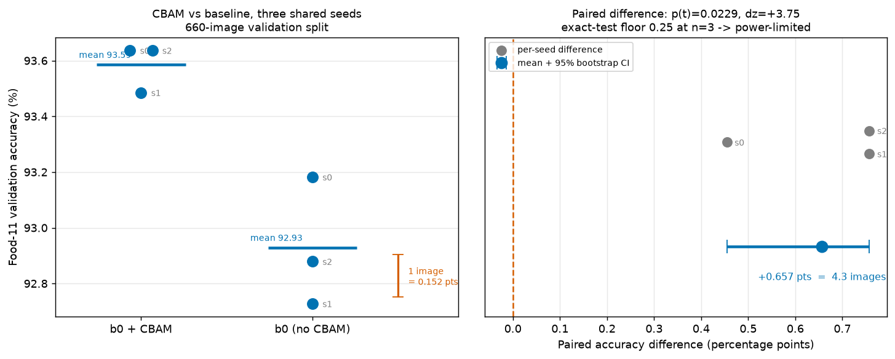

# Are published attention gains in food recognition larger than seed noise?

**Status of this document.** This is the third of three tasks. Tasks 1 and 3
(a 25,250-image validation set, and paired significance testing) are complete
and documented in [`significance.md`](significance.md). Task 2 — reproducing
published work to test whether its claimed attention gains survive seed
variance — is **not complete**, and this document is explicit about which parts
were done and which were not.

- **Commit:** see `git log`; branch `feat/statistical-significance`
- **Hardware:** Apple M5 Pro, 18 cores, 48 GB, macOS 26.5.1 arm64. MPS; CUDA
  unavailable
- **Date:** 2026-09-13
- **Machine-readable audit:** [`benchmarks/attention_claims_audit.json`](benchmarks/attention_claims_audit.json)
- **Wider corpus:** [`benchmarks/attention_corpus_17.json`](benchmarks/attention_corpus_17.json),
  [statistics](benchmarks/attention_corpus_17_stats.json)

> **On the automated guard-rail.** `scripts/audit_attention_doc.py` re-derives
> every number here from its source and refuses prose that asserts published
> gains are noise. It is a **checking aid, not a mechanical guarantee**. The
> banned-claim detector matches normalised sentence patterns, so a sufficiently
> indirect phrasing, a claim spread across several sentences, or one made in a
> figure or a file the script does not read, can still get through. It is
> calibrated to catch careless paraphrase, not to be adversarially complete.
> Passing it is necessary, never sufficient — the separation of *what this
> project measured* from *what other people published* is a claim the authors
> have to keep honestly, and the script only makes lapses more likely to be
> noticed.

---

## 1. What was asked, and what is honestly deliverable

The proposal was: reproduce 5–8 published works that add an attention module to
a food classifier, run each at 3–5 seeds, and test whether the improvements they
claim are significant. The appeal is real — it is a methodological critique with
a clear novelty claim, and it reuses infrastructure this project already has.

Splitting it into two questions makes the feasibility obvious:

| | Q1: Does anyone report seed variance? | Q2: Does each claimed gain fall inside its own seed noise? |
| --- | --- | --- |
| **Needs** | reading papers and their artefacts | retraining every paper, 3–5 seeds each |
| **Cost** | hours | hundreds of GPU-hours |
| **Status** | **done, §2** | **not done, §4** |

Q1 is answered below and the answer is clean. Q2 is the actual research
contribution and it is not affordable on this hardware; §4 gives the measured
numbers rather than an excuse. §3 reports the one paired attention experiment
that *was* run, on this project's own infrastructure.

---

## 2. Verified: the artefact audit

Seven works were triaged in depth. Availability was checked on **independent
channels** — the publisher/arXiv landing page, the GitHub REST search API, the
HuggingFace model API, and Google Scholar author profiles — rather than inferred
from abstracts. Full records in
[`benchmarks/attention_claims_audit.json`](benchmarks/attention_claims_audit.json).

| Paper | Claim | Code | Weights | Data | Reports repeated runs |
| --- | --- | --- | --- | --- | --- |
| Rokhva & Teimourpour 2025 (EffNetB7+CBAM, Food-11) | 96.40% | **yes** | no | yes | **yes, 5 runs** |
| Liu et al. 2024 CBiAFormer (TIP) | Food-101 SOTA-adjacent | **yes** | claimed | partial | **no** |
| Deng et al. 2024 MAMS-net (CMC) | 91.12% Food-101, +1.04 | no | no | partial | **no** |
| Xu et al. 2021 (CBAM+MobileNetV2/VGG16/ResNet50) | 87.33% | no | no | no | **no** |
| BSAM 2025 (JSEE) | Food-101 et al. | no | no | yes | **no** |
| Singh & Susan 2023 (Xception) | 84.54% Food-101 | no | no | yes | **no** |
| Sayudha & Sthevanie 2025 (ResNet50+CBAM) | 94.42% | no | no | no | **no** |

**2 of 7 publish code. 0 of 7 publish weights. 1 of 7 reports repeated runs.**

### 2.1 The strongest single finding

Rokhva & Teimourpour is the closest published analogue to this project: same
dataset family, same backbone family, same attention module. Their code exists
but is **not linked from either the arXiv page or the journal page** — it was
found through a GitHub search on the author's surname.

Two facts about this paper are independent, and an earlier version of this
document conflated them. Both are stated here separately.

**What the code shows.** In 1,645 lines of the exported training script,
`grep -ci seed` returns **0**. There is no `torch.manual_seed`, no NumPy seed, no
`cudnn.deterministic`, and `DataLoader(shuffle=True)` on all three splits.

**What the paper reports.** Five runs, from scratch, with per-run numbers:

> "the model was trained, optimized, and then executed on the test data 5 times,
> each time all parameters were initialized from scratch" (§2.10), yielding
> **96.24%, 96.44%, 96.51%, 96.42%, and 96.38%** (§3). The headline 96.40% is the
> **mean of five** runs, and §4.2 gives best and worst as 96.51% and 96.24% — a
> spread of **0.27** pts.

So the honest reading is narrower than "no one repeats runs", and more specific:
the authors did repeat, and their spread is small, but because no seed is set
those five values are five uncontrolled draws that cannot be reproduced
individually. A prior draft of this audit recorded this paper as reporting no
variance, having inferred that from the `grep` result. **That inference was
wrong**: absence of seed control in the code says nothing about whether the paper
repeated runs. The corrected record, and the reasoning, are kept in
`correction_note` in the JSON.

**The gap that remains, and it is the decisive one.** This paper reports **no
no-CBAM ablation** — Table 1 is the EfficientNet family on ImageNet quoted from
the original paper, Table 2 compares against other Food-11 work. There is no
B7-versus-B7+CBAM row anywhere. So the paper publishes no *isolated attention
gain*, and the question "is their attention gain inside seed noise?" has no
published quantity to attach to. Answering it would mean running the no-CBAM arm
ourselves — doing the experiment the authors omitted, which is not the same thing
as reproducing a claim they made.

One further caveat found by reading rather than assuming: the exported script
computes accuracy with `torchmetrics.Accuracy(average="macro")` — macro-averaged
recall on an **imbalanced** 11-class split — so it is not directly comparable to
the micro/top-1 this project reports. This is a separate point from how the
96.40% was aggregated across runs, and should not be confused with it. Their eval
split is 3,347 images, so one image is worth 0.0299 pts there.

### 2.2 A wider bibliometric screen: where the pattern actually is

The seven records above are a deep artefact audit. A wider and shallower screen
was also run over **22** works, coding each from body tables rather than
abstracts, and is stored alongside them:

- Corpus: [`benchmarks/attention_corpus_17.json`](benchmarks/attention_corpus_17.json)
  ([CSV](benchmarks/attention_corpus_17.csv))
- Statistics: [`benchmarks/attention_corpus_17_stats.json`](benchmarks/attention_corpus_17_stats.json)
- Regenerate: `python scripts/attention_corpus_stats.py`

Funnel: 22 screened → 3 excluded (outside the time window, or no attention
module) → 2 unverifiable (full text unobtainable) → **K = 17 included**.

| Reported in the paper | k / 17 | Wilson 95% CI |
| --- | --- | --- |
| Repeated runs / seed variance | 1 / 17 | 1.0 – 27.0% |
| An isolated no-attention ablation | 16 / 17 | 73.0 – 99.0% |
| **Both** | **0 of 17** | **0.0 – 18.4%** |
| Any statistical test | 0 / 17 | 0.0 – 18.4% |

The structural result is the last two rows. Reporting run variance and reporting
an isolated attention gain **never co-occur** in this corpus. The one paper that
reports variance (Rokhva & Teimourpour) reports no ablation; all sixteen that
report an ablation report no variance. The gap is therefore not "nobody repeats
runs" but **"nobody who reports a gain also reports its variance"** — which is
what makes the significance of those gains undecidable from the literature
itself, without anyone needing to retrain anything.

**Scope.** These two sets overlap but the seven are **not a strict subset** of
the seventeen: they were built under different inclusion rules. Four of the seven
(Rokhva, Xu, Deng, Sayudha) are included in K=17; BSAM is present but
unverifiable; Singh & Susan is excluded from the corpus for having no attention
module at all; CBiAFormer was never screened against the corpus criteria. The
exact per-paper mapping is in `corpus_relationship` in the audit JSON.

**Not claimed.** That 0 of 17 co-occurrence means the published gains are wrong,
or that they are small. It means the literature does not report enough to tell,
and that K=17 is a small sample whose intervals are correspondingly wide.

### 2.3 A resolution audit that needs no retraining

Deng et al. publish no code, but they publish enough numbers to be checked
against measurement resolution. Their Food-101 test split is 25,250 images, so
**one image = 0.00396 pts**. From their Table 6 (where to insert the hybrid
attention module):

| Placement | Top-1 | Placement | Top-1 |
| --- | --- | --- | --- |
| stage 1 | 89.98 | s2+s3 | 90.76 |
| stage 2 | 90.68 | s2+s4 | 90.76 |
| stage 3 | 90.70 | s3+s4 | 90.75 |
| stage 4 | 90.71 | **s2+s3+s4** | **90.78** |

The selected configuration beats the runner-up by **0.02 pts = 5.0 images**, and
the top four placements sit inside a **0.03 pt = 7.6 image** band. These are
single runs with no variance reported. This project's own measured seed spread on
a comparable setup is 0.15–0.76 pts
([`benchmarks/food11_seed_variance.json`](benchmarks/food11_seed_variance.json)),
i.e. **5× to 25× that band**.

**Claim.** The *stage-placement ranking* in that table is not resolvable from the
evidence presented.

**Not claimed.** That the headline +1.04 pts (263 images) is noise. It is far
larger, and plausibly survives. Nor is this a reproduction: the comparison
imports this project's seed spread, measured on a different dataset and backbone,
as a plausibility scale. It does not establish Deng et al.'s actual seed spread.

---

## 3. Verified: a paired CBAM experiment on controlled infrastructure

Since no published work could be re-run, the substitute is to ask the same
question where every input *is* controlled: EfficientNet-B0 with and without
CBAM, three shared seeds each, everything else identical.

- Configs: `abl/configs_cbam/efficientnet_b0{,_cbam}_s{0,1,2}.yaml`
- 30 epochs, cosine, no early stopping, @224, batch 32, fp32, AutoAugment
- CBAM adds 0.205M params to 4.022M (**+5.1%**)
- Report: [`benchmarks/food11_cbam_ablation.json`](benchmarks/food11_cbam_ablation.json)
- Regenerate: `python scripts/cbam_ablation_report.py --run cbam=... --run nocbam=... --seeds 0 1 2`

A validity check worth recording: `cbam` seed 0 reproduced the pre-existing grid
cell `b0_224` **bit-exactly** (0.9363636363636364, cf.
[`benchmarks/food11_ablation_grid.json`](benchmarks/food11_ablation_grid.json)),
confirming the training path is deterministic given a seed and that this
experiment is on the same footing as the rest of the grid.

### 3.1 Results

| Config | mean | seed 0 | seed 1 | seed 2 |
| --- | --- | --- | --- | --- |
| `efficientnet_b0_cbam` | **93.59%** | 93.64 | 93.48 | 93.64 |
| `efficientnet_b0` | 92.93% | 93.18 | 92.73 | 92.88 |
| paired difference | **+0.657** | +0.455 | +0.758 | +0.758 |

Protocol: pairing unit is one seed; 10,000 percentile bootstrap resamples over
the three per-seed differences, RNG seed 20260913; alpha 0.05, two-sided; one
pre-planned comparison, so no multiplicity correction.

| Statistic | Value |
| --- | --- |
| Mean paired difference | **+0.657 pts** |
| Bootstrap 95% CI | **[+0.455, +0.758] pts** — excludes zero |
| Paired t-test | **p = 0.0229** |
| Exact sign-flip test | p = 0.250 (**its floor at n=3**) |
| Effect size (Cohen's *dz*) | **+3.75** |
| Difference in images | **4.3 of 660** |
| Verdict | `significant_parametric_only`, `power_limited = true` |

CBAM helped on **all three seeds**, and the effect is large relative to the
seed-to-seed scatter (*dz* = 3.75). But two caveats are recorded in the report
itself rather than glossed:

1. The exact sign-flip test **cannot** return anything below 0.25 with 3 seeds,
   so the only test that makes no normality assumption is unable to confirm this
   at alpha = 0.05 — by design, whatever the true effect. Six paired seeds is the
   minimum that can.
2. The t-test does reject, but on 3 points its normality assumption is
   unverifiable. Hence `significant_parametric_only` rather than "significant".

### 3.2 The number that matters most

**+0.657 pts is 4.3 images out of 660.** A real, thrice-replicated architectural
effect is worth about four images on this validation split. That is the same
order as the *entire* spread this project measures across seeds for a fixed
config (0.15–0.76 pts, i.e. 1–5 images), and it is smaller than the margin on
which Deng et al. select an attention placement is *not* (§2.2: 0.02 pts = 5
images, which is comparable in image count but arises from single runs).

The lesson is not "CBAM does not work here" — it does, consistently. It is that
**at n = 660 an effect this size is only detectable because the comparison is
paired on seeds.** A single run per configuration, which is what all seven
papers in §2 report, could not have distinguished it from noise: the per-seed
accuracies of the two configs (93.48–93.64 vs 92.73–93.18) are separated by less
than the 0.76 pt spread this project has measured within a single config
elsewhere in the grid.

### 3.3 What this experiment does and does not license

It **does** support a statement of the form "on this setup, a CBAM gain of the
observed size is / is not separable from seed noise at n=3."

It does **not** license the claim that published CBAM gains are within noise.
Those papers use different datasets, splits, backbones, schedules and metrics.
Substituting this result for theirs would be exactly the error this project
criticises. The two claims are kept apart, here and in the JSON.

---

## 4. Not completed: reproducing the published works

Measured on this machine, not assumed.

| Reproduction target | Basis | Cost per seed | 3 seeds |
| --- | --- | --- | --- |
| Rokhva & Teimourpour, EffNetB7 @256, 35 ep | **measured** 1.755 s/step at batch 16 → 18.0 min/epoch over 617 steps | **10.5 h** | **31.6 h** |
| This project's Food-101 B4 @224, 30 ep | measured, `f101/b4_food101_224.log` | 11.2 h | 33.6 h |
| This project's Food-101 B0 @224, 30 ep | measured, `f101/food101_bench.log` | 4.2 h | 12.7 h |

Two MPS trainings run concurrently slow each other by roughly 2×, so these are
serial estimates. Observed directly during this session: the B0 @224 runs in §3
took ~22 min each against a measured 10.7 min baseline, because a second sweep
was running.

Per paper, the blocker is specific:

- **Rokhva & Teimourpour** — the only paper that is both code-complete and
  scale-appropriate. Blocked purely on 31.6 h of compute. Also needs the
  canonical 16,643-image Food-11 downloaded, because this project's cached
  Food-11 is the NTU ML2021-HW3 re-split (3,080 labelled train / 660 val), not
  the canonical release. **This is the single highest-value next step.**
- **Liu et al. CBiAFormer** — code exists, but a bi-branch transformer at
  Food-101 scale exceeds the 11.2 h that EfficientNet-B4 already costs here,
  times three seeds. Best target if GPU time appears.
- **Deng et al., BSAM, Xu et al., Singh & Susan, Sayudha & Sthevanie** — no code.
  Reimplementing from prose introduces a confound that defeats the purpose: a
  failed reproduction could not be attributed between the method and my
  reimplementation. For Xu et al. and Sayudha & Sthevanie the datasets are also
  not public.

### 4.1 Novelty, stated honestly

"Seed variance can reorder a leaderboard" is **already published** — see
*NAS Evaluation is Frustratingly Hard* (arXiv:1912.12522), arXiv:1902.08142, and
*Deep Reinforcement Learning that Matters* (arXiv:1709.06560). Any novelty here
is confined to the narrow intersection: *attention-module gains specifically in
food recognition*. §2 establishes what the gap actually is — not that nobody
repeats runs, but that **0 of 17** papers report repeated runs and an isolated
attention ablation together, so the significance of the published gains cannot be
decided from the literature. Closing it requires §4's compute.

---

## 5. Summary

**Verified in this session:**

1. 7 works triaged in depth across independent channels: 2 publish code, 0
   publish weights, **1 of 7 reports repeated runs**.
2. The closest analogue (Rokhva & Teimourpour, 96.40%) reports **five**
   from-scratch runs — 96.24 / 96.44 / 96.51 / 96.42 / 96.38, spread **0.27**
   pts — while setting **no random seed anywhere** in 1,645 lines. Those are
   compatible: the runs were repeated, but each is an uncontrolled draw. The
   paper reports **no no-CBAM ablation**, so it publishes no isolated attention
   gain that could be tested against seed noise.
3. A wider screen of 22 works (**K = 17** after exclusions) finds that reporting
   run variance and reporting an isolated attention ablation **never co-occur**:
   **0 of 17**, Wilson 95% CI 0.0–18.4%. One paper reports variance without an
   ablation; sixteen report an ablation without variance.
4. Deng et al. select an attention placement on a **0.02 pt = 5-image** margin
   from single runs; their top four placements span 7.6 images, versus this
   project's measured 0.15–0.76 pt seed spread.
5. A paired CBAM-vs-baseline experiment at 3 shared seeds on controlled
   infrastructure: **+0.657 pts, CI [+0.455, +0.758], p = 0.0229, dz = +3.75**,
   consistent across all three seeds — but worth only **4.3 images of 660**, and
   flagged `power_limited` because the exact test's floor at n=3 is 0.25. Seed 0
   reproduced the existing grid cell bit-exactly.

**Corrected in this session:** this document previously stated that 0 of 7 papers
report seed variance, inferring it from `grep -ci seed` returning 0 over Rokhva &
Teimourpour's code. Absence of seed control in code does not imply absence of
repeated runs in the paper; reading the PDF refuted it. The speculation that
their 96.40% was a macro-average across classes is likewise refuted — it is the
**mean of five** runs.

**Not done, with measured costs:** retraining any published work. The most
tractable is 31.6 h for three seeds of one paper; the rest are blocked on absent
code or absent data. No number in this document comes from a run that did not
happen.